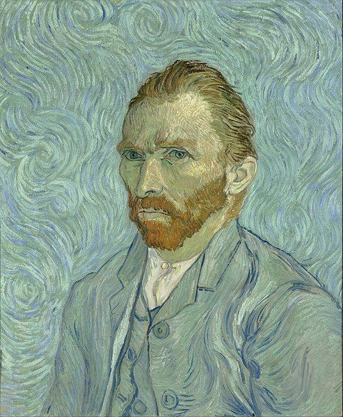
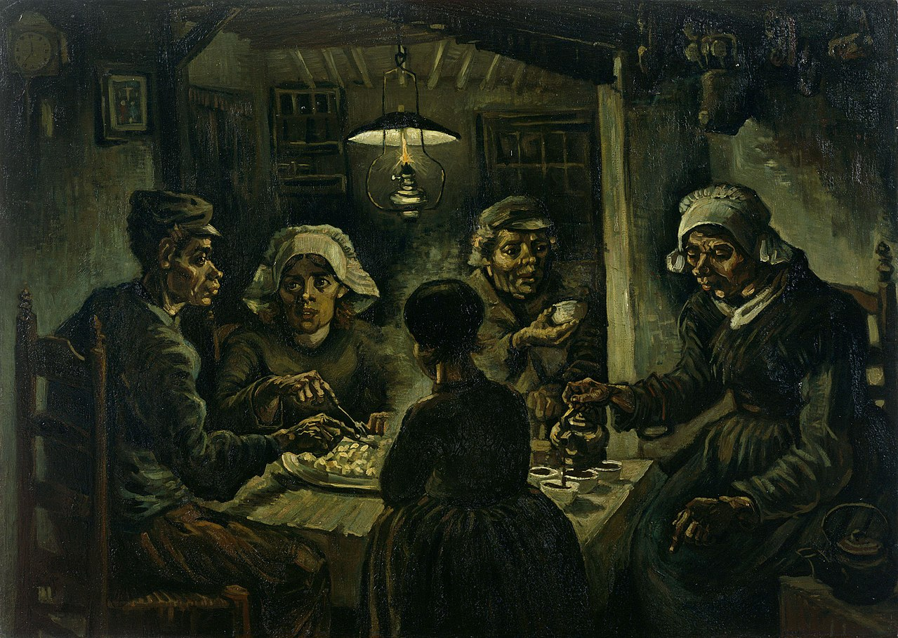

%{
    title: "Posts 🐹",
    published: true,
    position: 1
}
---

Post: "Docs > Posts 🐹". The rest of the content is similar to some other sample pages from this sample content.

Vincent Willem van Gogh (Dutch: [ˈvɪnsənt ˈʋɪləm vɑŋ ˈɣɔx] (About this soundlisten);[note 1] 30 March 1853 – 29 July 1890) was a Dutch post-impressionist painter who posthumously became one of the most famous and influential figures in the history of Western art. In a decade, he created about 2,100 artworks, including around 860 oil paintings, most of which date from the last two years of his life. They include landscapes, still lifes, portraits and self-portraits, and are characterised by bold colours and dramatic, impulsive and expressive brushwork that contributed to the foundations of modern art. He was not commercially successful, and his suicide at thirty-seven came after years of depression and poverty.

# Life
## Early years
Vincent Willem van Gogh was born on 30 March 1853 in Groot-Zundert, in the predominantly Catholic province of North Brabant in the Netherlands.[23] He was the oldest surviving child of Theodorus van Gogh (1822–1885), a minister of the Dutch Reformed Church, and his wife Anna Cornelia Carbentus (1819–1907). Van Gogh was given the name of his grandfather and of a brother stillborn exactly a year before his birth.[note 2] Vincent was a common name in the Van Gogh family. The name had been borne by his grandfather, the prominent art dealer Vincent (1789–1874), and a theology graduate at the University of Leiden in 1811. This Vincent had six sons, three of whom became art dealers, and may have been named after his own great-uncle, a sculptor (1729–1802).[25]

 {: .img-fluid}

## Etten, Drenthe and The Hague
Van Gogh returned to Etten in April 1881 for an extended stay with his parents.[61] He continued to draw, often using his neighbours as subjects. In August 1881, his recently widowed cousin, Cornelia "Kee" Vos-Stricker, daughter of his mother's older sister Willemina and Johannes Stricker, arrived for a visit. He was thrilled and took long walks with her. Kee was seven years older than he was and had an eight-year-old son. Van Gogh surprised everyone by declaring his love to her and proposing marriage.[62] She refused with the words "No, nay, never" ("nooit, neen, nimmer").[63] After Kee returned to Amsterdam, Van Gogh went to The Hague to try to sell paintings and to meet with his second cousin, Anton Mauve. Mauve was the successful artist Van Gogh longed to be.[64] Mauve invited him to return in a few months and suggested he spend the intervening time working in charcoal and pastels; Van Gogh went back to Etten and followed this advice.[64]

## Emerging artist
### Nuenen and Antwerp (1883–1886)
In Nuenen, Van Gogh focused on painting and drawing. Working outside and very quickly, he completed sketches and paintings of weavers and their cottages. Van Gogh also completed The Parsonage Garden at Nuenen, which was stolen from the Singer Laren in March 2020.[89][90] From August 1884, Margot Begemann, a neighbour's daughter ten years his senior, joined him on his forays; she fell in love and he reciprocated, though less enthusiastically. They wanted to marry, but neither side of their families were in favour. Margot was distraught and took an overdose of strychnine, but survived after Van Gogh rushed her to a nearby hospital.[82] On 26 March 1885, his father died of a heart attack

### Paris (1886–1888)
Van Gogh moved to Paris in March 1886 where he shared Theo's rue Laval apartment in Montmartre and studied at Fernand Cormon's studio. In June the brothers took a larger flat at 54 rue Lepic.[111] In Paris, Vincent painted portraits of friends and acquaintances, still life paintings, views of Le Moulin de la Galette, scenes in Montmartre, Asnières and along the Seine. In 1885 in Antwerp he had become interested in Japanese ukiyo-e woodblock prints and had used them to decorate the walls of his studio; while in Paris he collected hundreds of them. He tried his hand at Japonaiserie, tracing a figure from a reproduction on the cover of the magazine Paris Illustre, The Courtesan or Oiran (1887), after Keisai Eisen, which he then graphically enlarged in a painting

# Style and works
## Artistic development
Van Gogh drew, and painted with watercolours while at school, but only a few examples survive and the authorship of some has been challenged.[217] When he took up art as an adult, he began at an elementary level. In early 1882, his uncle, Cornelis Marinus, owner of a well-known gallery of contemporary art in Amsterdam, asked for drawings of The Hague. Van Gogh's work did not live up to expectations. Marinus offered a second commission, specifying the subject matter in detail, but was again disappointed with the result. Van Gogh persevered; he experimented with lighting in his studio using variable shutters and different drawing materials. For more than a year he worked on single figures – highly elaborate studies in black and white,[note 11] which at the time gained him only criticism. Later, they were recognised as early masterpieces.

 {: .img-fluid}

## Major series
Van Gogh's stylistic developments are usually linked to the periods he spent living in different places across Europe. He was inclined to immerse himself in local cultures and lighting conditions, although he maintained a highly individual visual outlook throughout. His evolution as an artist was slow, and he was aware of his painterly limitations. He moved home often, perhaps to expose himself to new visual stimuli, and through exposure develop his technical skill.[242] Art historian Melissa McQuillan believes the moves also reflect later stylistic changes, and that Van Gogh used the moves to avoid conflict, and as a coping mechanism for when the idealistic artist was faced with the realities of his then current situation.

### Portraits
The portraits gave Van Gogh his best opportunity to earn. He believed they were "the only thing in painting that moves me deeply and that gives me a sense of the infinite."[241][244] He wrote to his sister that he wished to paint portraits that would endure, and that he would use colour to capture their emotions and character rather than aiming for photographic realism.[245] Those closest to Van Gogh are mostly absent from his portraits; he rarely painted Theo, Van Rappard or Bernard. The portraits of his mother were from photographs.